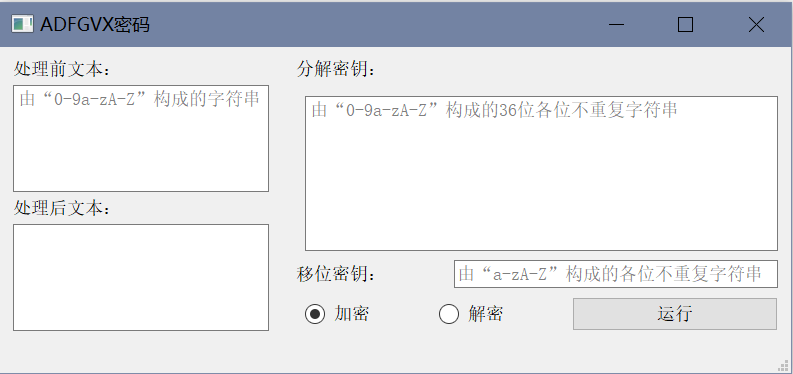

# ADFGVX密码-使用手册

# 0. 目录

# 1. 环境语言

QT 5.15.2；C++

# 2. 程序设计

## 2.1 移位密钥

```cpp
QString eu = "ABCDEFGHIJKLMNOPQRSTUVWXYZ";

void getOrder(){       //获得移位密钥的排序顺序
    int t = -1;
    QString shKey = s_ShKey.toUpper();
    for (int i=0;i<26;i++){
        if (shKey.indexOf(eu[i],0) != -1){
            order[++t] = shKey.indexOf(eu[i],0);  //扫描26位英文字母表获取移位密钥字母排序数组order的值
        }
    }
}
```

## 2.2 加密过程

```cpp
QString s_Key = "ADFGVX";
QString s_AfterDeal, s_ShKey, s_BeforeDeal, s_DeKey; //加密后密文、移位密钥、加密前密文、分解密钥

void doEncrypt(){        //加密处理
    QString s = "";
    char *tmpcs,tmpc;
    int pos,i,j;

    /* 扫描未处理的密文，将其进行加密 */
    for (i=0;i<s_BeforeDeal.length();i++){
        /* 获取密文第i个字符 */
        tmpcs = s_BeforeDeal.toLatin1().data();
        tmpc = tmpcs[i];
        if (tmpc >= 'A' && tmpc <= 'Z') tmpc = tmpc  + 'a' - 'A';
        /* 密文第i个字符按分解密钥分解 */
        if ((tmpc >= '0' && tmpc <= '9')||(tmpc >= 'a' && tmpc <= 'z')){
            pos = s_DeKey.indexOf(tmpc,0);         //获取字符在分解密钥中的坐标
            ****s = s + s_Key[pos/6] + s_Key[pos%6];   //根据字符在分解密钥中的位置将其分解
****        }
    }

    /* 最后一行如不满，用字符“_”填充 */
    while (s.length()%s_ShKey.length() != 0){
        s += "_";
    }

    /* 根据移位密钥将密文进一步加密 */
    for (i=0;i<s_ShKey.length();i++){
        j = 0;
        while (order[i]+j*s_ShKey.length() < s.length()){
            s_AfterDeal += s[order[i]+j*s_ShKey.length()];  //根据移位密钥字母顺序进行置换加密，生成密文
            j++;
        }
    }
}
```

## 2.3 解密过程

```cpp
QString s_Key = "ADFGVX";
QString s_AfterDeal, s_ShKey, s_BeforeDeal, s_DeKey; //加密后密文、移位密钥、加密前密文、分解密钥

void doDecrypt(){        //解密处理
    QString s = "";
    QString tmp;
    int i,j;
    s_BeforeDeal = s_BeforeDeal.toUpper();

    /* 根据分解密钥获得分解顺序 */
    int ordertmp[24] = {};
    for (i=0;i<s_ShKey.length();i++){
        ordertmp[order[i]] = i;
    }

    /* 根据移位密钥将密文解密 */
    for (i=0;i<s_BeforeDeal.length()/s_ShKey.length();i++){
        for (j=0;j<s_ShKey.length();j++){
            tmp = s_BeforeDeal[ordertmp[j]*(s_BeforeDeal.length()/s_ShKey.length())+i]; //根据移位密钥字母顺序逐行还原
            if (tmp != "_") s += tmp;
        }
    }

    /* 根据分解密钥将密文进一步解密 */
    for (i=0;i<s.length();i+=2){
        s_AfterDeal += s_DeKey[s_Key.indexOf(s[i],0)*6+s_Key.indexOf(s[i+1],0)];  //根据计算得到的该字符在分解密钥中对应的下标进行解密
    }
}
```

# 3. 界面设计



界面布局

## 3.1 界面构成

界面由三个文本框、两个单选框和一个按钮组成。文本框内有密文和密钥的输入要求提示。

## 3.2 界面功能

### 3.2.1 使用过程

1. 在“处理前文本”框内按要求输入待处理的密文；
2. 在“分解密钥”框内按要求输入待处理的密文；
3. 在“移位密钥”框内按要求输入待处理的密文；
4. 根据需求选择“加密”或“解密”；
5. 点击“运行”键，处理后的文本显示在“处理后文本”框中。

### 3.2.2 使用示例

1. 分解密钥示例
   
    0aeyz5p1ufiognhv3cq2brdsjk6wm49xt78l
    
    |  |  | 0 | 1 | 2 | 3 | 4 | 5 |
    | --- | --- | --- | --- | --- | --- | --- | --- |
    |  |  | A | D | F | G | V | X |
    | 0 | A | 0 | a | e | y | z | 5 |
    | 1 | D | p | 1 | u | f | i | o |
    | 2 | F | g | n | h | v | 3 | c |
    | 3 | G | q | 2 | b | r | d | s |
    | 4 | V | j | k | 6 | w | m | 4 |
    | 5 | X | 9 | x | t | 7 | 8 | l |
2. 加密示例1
   
    
    
    
    
3. 加密示例2
   
    
    
    
    
4. 加密示例3
   
    
    
    
    
5. 解密示例1
   
    
    
    
    
6. 解密示例2
   
    
    
    
    
7. 解密示例3
   
    
    
    
    

# 4. 文件结构

10191502419倪寻珂_hw2
├──ADFGVX
│      ├──ADFGVX.pro
│      ├──ADFGVX.pro.user
│      ├──main.cpp
│      ├──mainwindow.cpp
│      ├──mainwindow.h
│      └──mainwindow.ui
├──EXE
│      └──ADFGVX.exe
└──ADFGVX密码-使用手册.pdf

# 5. 参考资料

1. QString常用成员函数总结 [https://www.cnblogs.com/linuxAndMcu/p/10949448.html#_label3_2](https://www.cnblogs.com/linuxAndMcu/p/10949448.html#_label3_2)
2. QT开发教程 [https://blog.csdn.net/bili_mingwang/category_11945281.html](https://blog.csdn.net/bili_mingwang/category_11945281.html)
